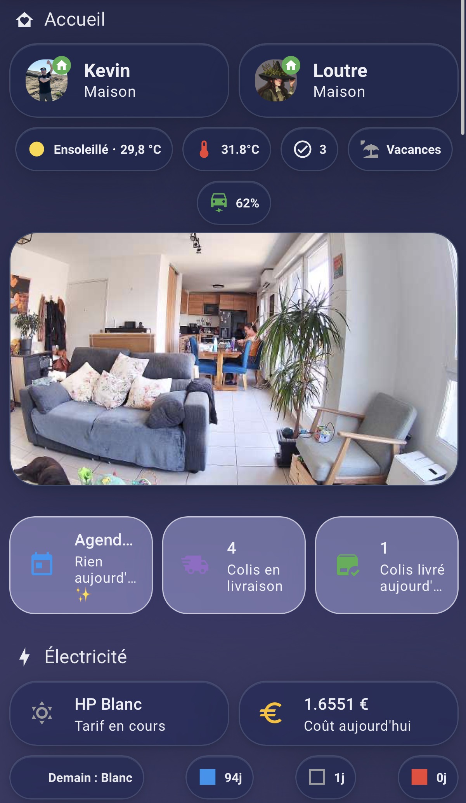

# Ma maison qui pense

  
  
  
  
  
   
  
  
  
  
  

> Architecture Home Assistant pour foyer 2 adultes + bébé + chien + chat,
> appart 3e étage. Pilotage Matter + Zigbee, cerveau Claude AI, brief vocal,
> caméras UniFi, suivi conso, et un Pi tactile dans l'entrée.

> 📖 Le récit complet, avec captures et coulisses : **[cyberloutre.fr](https://cyberloutre.fr)**
> Ce dépôt contient le **code réel** (dashboards, automatisations, packages), nettoyé de tout secret.

---

## Le principe : "passive smart home"

Pas de "Hey Siri, allume la lumière". La maison observe et agit :
- La SDB s'allume quand on entre, reste allumée tant qu'on prend une douche,
  s'éteint quand on en sort
- Les volets se ferment quand il pleut + une fenêtre est ouverte
- Le four notifie uniquement les iPhones des personnes présentes
- Claude AI rédige chaque soir un brief naturel de la journée

C'est silencieux, contextuel, et ça libère du temps mental.

---

## Explorer le code

| Dossier | Contenu |
|---------|---------|
| [`dashboards/`](./dashboards) | `ui-lovelace.yaml` (vue principale « Aperçu » + « Tout ») et les dashboards dédiés (énergie, maintenance, showcase, tablette, Tesla, imprimante 3D). Cartes **Mushroom** + `card_mod`, style glassmorphism, mobile-first. |
| [`automations/`](./automations) | `automations.yaml`, `scripts.yaml`, `scenes.yaml`. |
| [`packages/`](./packages) | Automatisations groupées par thème (éclairages par pièce, climat salon, veilleuse Raphaël, tâches récurrentes, modes vacances/nounou, Nabaztag, notifications, zones…). |
| [`secrets.yaml.example`](./secrets.yaml.example) | Les clés `!secret` référencées — à remplir avec vos valeurs. |

> Tous les secrets (tokens, mots de passe, domaine, IP internes, coordonnées GPS)
> sont externalisés via `!secret` ou redactés. Aucune donnée sensible n'est publiée.

---

## 6 automatisations qui me changent la vie

### 🌧️ Pluie + fenêtre ouverte = volets fermés
Le pluviomètre Netatmo détecte > 0.1 mm/h. Si une fenêtre est restée
ouverte, les volets exposés se ferment automatiquement + notif iPhone.

### 🚿 Douche en cours = lumière protégée
Couplage capteur de mouvement Aqara P2 + humidité SDB. Tant que HR > 55%
et que quelqu'un est dans la pièce, la lumière ne s'éteint pas, même
sur un appui accidentel ou un timer firmware fantôme.
→ [`packages/sdb_lampes.yaml`](./packages/sdb_lampes.yaml)

### 🤖 Mercredi/Samedi/Dimanche : aspirateur autonome
Si tout le monde est absent > 5 min, le Roborock S8 démarre. Si quelqu'un
rentre, retour dock immédiat. La machine mémorise la zone restante et
reprend la prochaine fois.

### 🌙 Brief soir 22h via Claude AI
Snapshot de la journée (conso élec, T° par pièce, présence, anomalies)
envoyé à Claude Haiku 4.5 qui rédige un brief naturel sur les 2 iPhones.
Pas un dump de chiffres : un point de situation chaleureux.

### 🖨️ Détection spaghetti Prusa (Claude vision)
Pendant une impression 3D, toutes les 10 min, snapshot caméra envoyé à
Claude qui analyse visuellement. Si STATUS=fail détecté : notif iPhone
avec boutons "Pause" / "Annuler" actionnables.

### 🚨 Four en marche + personne home = alerte critique
Notif `interruption-level: critical` (passe au-dessus de tous les focus
iOS) avec bouton "🛑 Arrêter à distance".

---

## Le stack

| Couche | Technos |
|--------|---------|
| **Backbone** | Home Assistant OS · reverse proxy (Pangolin) |
| **Matter / Zigbee** | Aqara Hub M3 (Bridge Matter) · Zigbee2MQTT · UniFi Protect · Hue |
| **Climatisation** | Daikin (bridge custom : `input_number` salon = source de vérité) |
| **Énergie** | Lixee Linky (Zigbee) · RTE Tempo · Power Flow Card+ |
| **AI** | Anthropic Claude Haiku 4.5 (brief soir + détection vision Prusa) |
| **Voice** | HA Companion iOS Assist (Voice PE prévu) |
| **Wall panel** | Raspberry Pi + Display 7" tactile en kiosk Chromium |

---

## En chiffres

- **~160** automatisations actives (YAML + packages)
- **30+** capteurs Aqara appairés en Matter
- **4** caméras UniFi avec AI person detection
- **6** pièces avec capteurs T° / HR / CO₂ individuels
- **1** brief Claude AI quotidien (~30 cents/mois)

---

## Pourquoi pas un système clé en main type Alexa Home ?

1. **Données locales** : tout reste sur le réseau, Anthropic ne voit que
   les requêtes de brief, pas la maison en continu.
2. **Pas de cloud propriétaire** : si Aqara/Tesla/Samsung ferment leur
   service demain, la maison continue de tourner sur le bus local.
3. **Extensibilité** : nouvelle intégration ? 5 min en YAML. Nouvelle
   automation ? 30 lignes.
4. **Coût** : ~5 €/mois (Claude API + électricité).

---

## Réutiliser ce dépôt

Ce code est fourni comme **référence / inspiration**, pas comme un produit
clé en main : les `entity_id`, `device_id` et noms de pièces sont ceux de
mon installation. Piochez les patterns (cartes Mushroom, templates Jinja,
structure en packages) et adaptez.

🦦 **[cyberloutre.fr](https://cyberloutre.fr)** · code + soin
